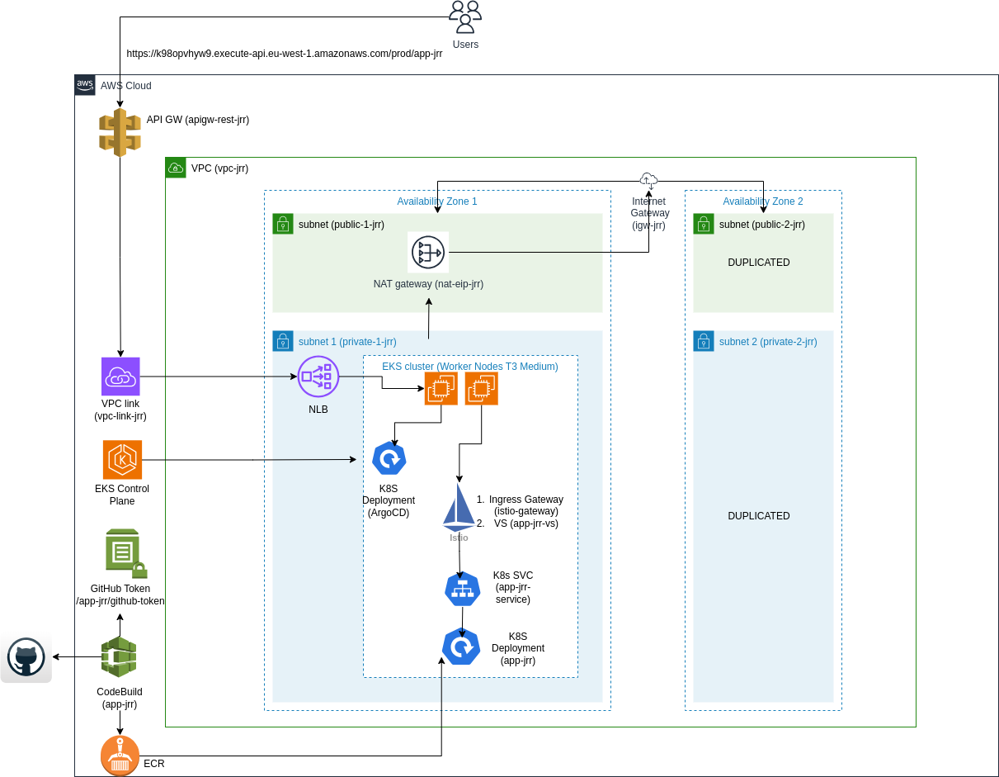

# APP-JRR

The app-jrr application is a basic Python and Flask app that displays the currently deployed version on the screen, followed by an image. The image is retrieved from the mounted volume /data using the [CSI driver](https://github.com/awslabs/mountpoint-s3-csi-driver). The image is built from a basic pipeline in AWS CodeBuild, and the deployment is managed through ArgoCD. The network architecture for the application is based on AWS API Gateway, NLB, EKS, and Istio as the service mesh.

## Network diagram



## Content

```
├── apps                                      # Apps managed by ArgoCD
│   ├── app-jrr                               # Test APP K8S resources 
│   │   ├── deployment.yaml
│   │   ├── istio-vs.yaml
│   │   ├── kustomization.yaml
│   │   ├── namespace.yaml
│   │   └── svc.yaml
│   ├── argocd                                # ArgoCD K8S resources
│   │   ├── appset.yaml
│   │   ├── kustomization.yaml
│   │   └── namespace.yaml
│   └── istio                                 # Istio K8S resources
│       ├── ingressgateway-nlb-patch.yaml
│       ├── istio-gateway.yaml
│       ├── istio-generated.yaml
│       ├── kustomization.yaml
│       └── namespace.yaml
├── app-src                                   # Test APP Source code
│   ├── app.py
│   ├── Dockerfile
│   └── requirements.txt
├── buildspec.yml                             # Codebuild pipeline
├── doc                                       # Repo documentation
│   └── network-diagram.png
├── README.md
└── tf                                        # AWS Infra
    ├── apigw.tf
    ├── app.tf
    ├── backend.tf
    ├── codebuild-policy.json
    ├── codebuild.tf
    ├── eks.tf
    ├── network.tf
    ├── provider.tf
    ├── s3.tf
    └── variables.tf
```

Before starting, remember to export the following environment variables:
**AWS_ACCESS_KEY_ID**, **AWS_SECRET_ACCESS_KEY**, **AWS_DEFAULT_REGION** and review the parameters.
The infrastructure deployment has not been tested for full one-shot provisioning.
